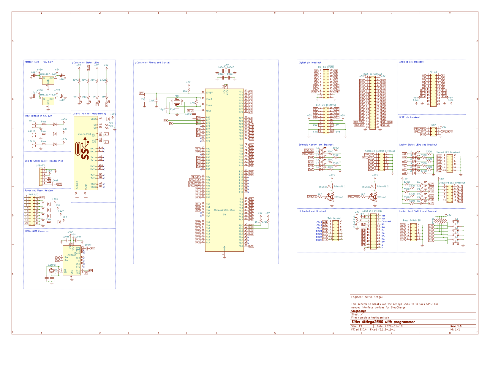
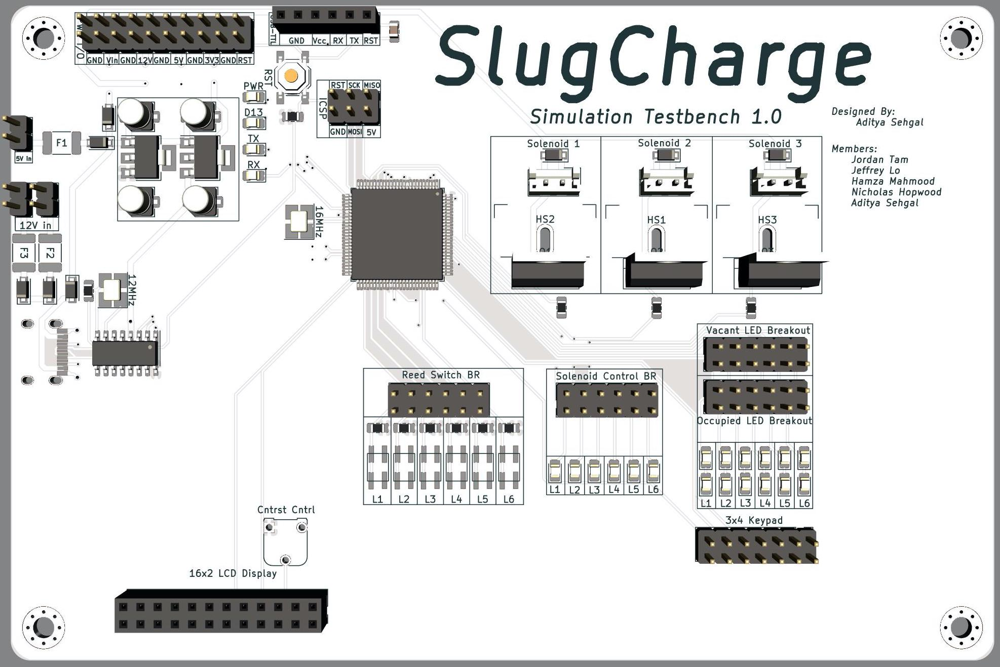
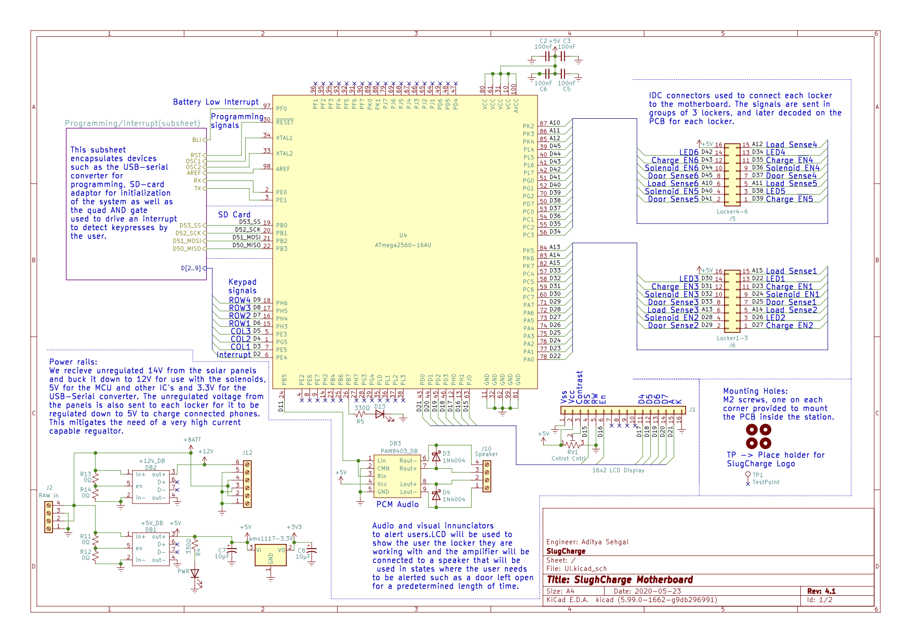
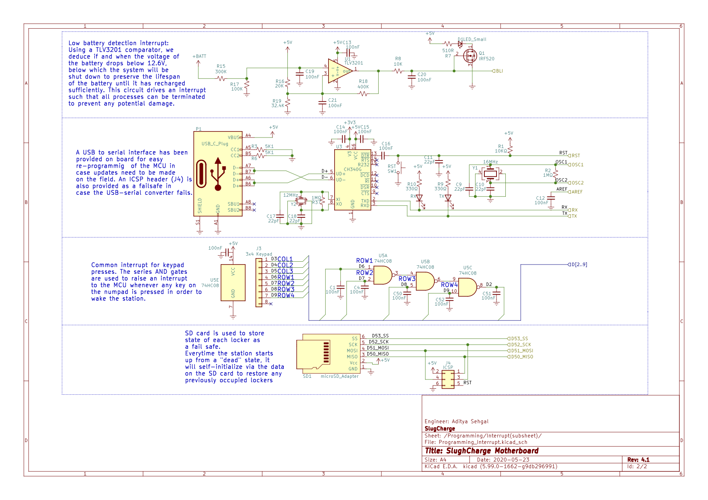
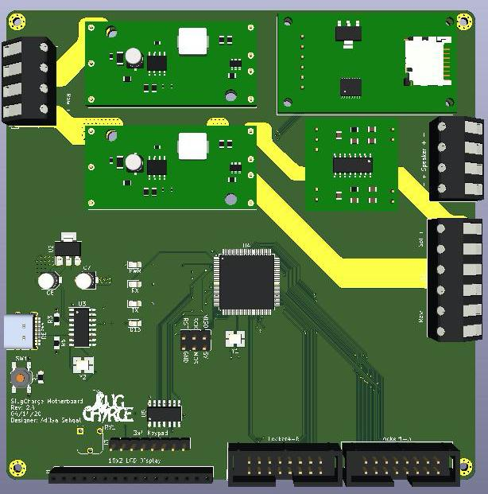
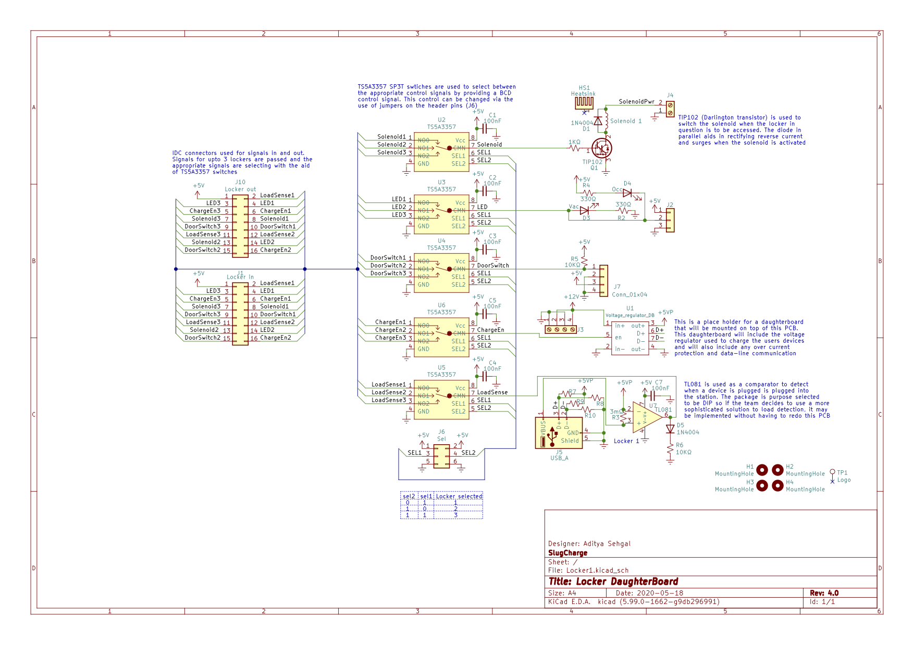
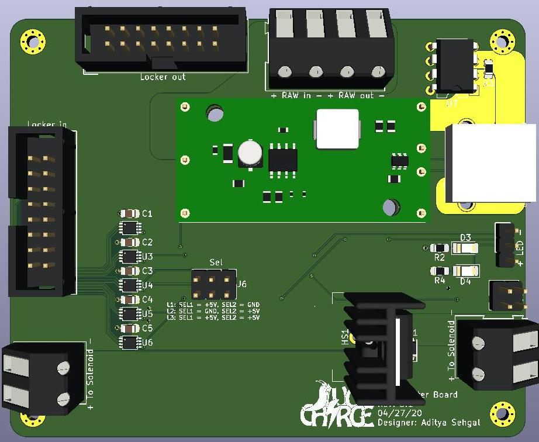
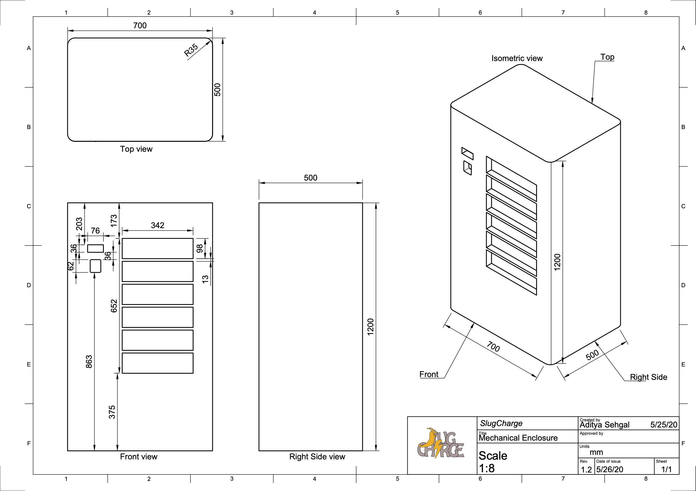
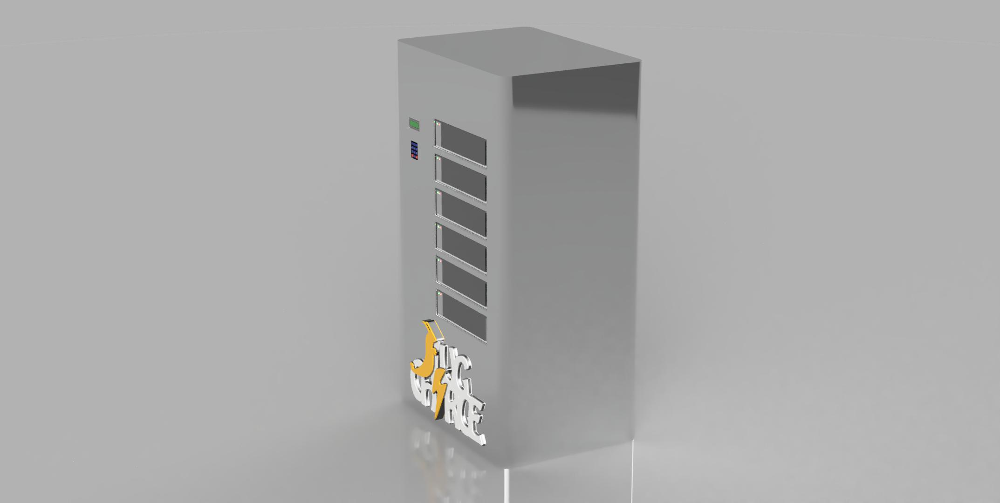

# *SlugCharge*

SlugCharge was a student run project geared towards helping the homeless communit of Santa Cruz, CA. The project was led by four Electrical Engineering students at the University of California, Santa Cruz. The team aimed towards providing solar powered charging stations to the community so they can stay conencted with family and potential employers that may turn their life around! 

### My Roles

* PCB Design
* Mechnical Design
* Graphic Design
* Video Creation

<!-- START OF PCB SECTION -->
### PCB Design

#### PCB #1 - Testbench V1.0
[Project Files](https://github.com/adsehgal/SlugCharge/tree/master/SlugCharge_Testbench_V1.0) - KiCad
* We first started with making a testbench that was able to run our code and interact with the required I/O  
    Requirements: 
    * Utilize the **ATmega2560** as the main processor
    * Be **easliy programmable** for future code updates
    * Contain **visual annunciators** for easy state tracking 
    * Utilize **breakout pins** for off-board I/O control
    * Should **not require off-board voltage regulation**
    * Should be easily **hand assembled**
    * Restricted to a **2-layer PCB**
* The design was started off with referring to the Arduino Mega Development board and adapted to fit the required I/O:

  

* Next I moved onto laying out the PCB as per the requirements to get the following design:

  

#### PCB #2 - Motherboard V2.4
[Project Files](https://github.com/adsehgal/SlugCharge/tree/master/SlugCharge_Motherboard) - KiCad
* We followed the success of the testbench with a custom motherboard  
    Requirements: 
    * Utilize the **ATmega2560** as the main processor
    * Be **easliy programmable** for future code updates
    * Should **not require off-board voltage regulation**
    * Should **not be directly connected** to the individual lockers
    * Restricted to a **2-layer PCB**

To keep the motherboard physically isolated from the individual lockers, we decided to design a daughterboard for each locker that would connect to the motherboard via IDC cables

  

  

* Next I moved onto laying out the PCB as per the requirements to get the following design:

  

#### PCB #3 - Daughterboard V4.0
[Project Files](https://github.com/adsehgal/SlugCharge/tree/master/SlugCharge_Daughterboard) - KiCad
* We followed the success of the testbench with a custom daughterboard  
    Requirements: 
    * Connect with the motherboard **using IDC cables**
    * Provide a **voltage regulator per locker** to charge devices
    * Should be **easily replacable**
    * Should **not contain any complex devices**
    * Restricted to a **2-layer PCB**

To charge the devices in each locker, we decided to give each of these PCBs a second voltage regulator PCB for easy servicability. This regulator was chose to be the [TPS62133](https://github.com/adsehgal/SlugCharge/tree/master/TPS62133)

  

* Next I moved onto laying out the PCB as per the requirements to get the following design:

  

<!-- END OF PCB SECTION -->

<!--START OF  VOLTAGE REGULATOR -->
### Voltage Regulator selection

<!-- END OF VOLTAGE REGULATOR -->
[Regulator Comparison Sheet](https://github.com/adsehgal/SlugCharge/blob/master/Regulator_selection.pdf) - PDF 
[Regulator Design Files](https://github.com/adsehgal/SlugCharge/tree/master/TPS62133) - KiCad
* I decided to use the TPS62133 constant 5.0V switching regulator to charge connected devices. This regulator was selected for the following reasons:   
  * Relatively low cost
  * Extremely high efficiency
  * Very low output ripple
  * On chip enable pin
  * High current capability
  
<!-- START OF MECH SECTION -->
### Mechanical Design
[Mechanical Drafts](https://github.com/adsehgal/SlugCharge/tree/master/Mechanical) - Fusion360
* Given the restrictions due to COVID-19, the team was unable to build the station, however we rendered a 3-D model for any future teams that may be intereste in taking up this project 
    Requirements: 
    * Be designed to accomodate the **average person height**
    * Hold at least **6 devices simultaneously**
    * Be resistant to **tampering**
    * **Solar Powered**

We drafted the 3-D model and orthographic drawings using Fusion360. This was done to aid future teams who may be interested in continuing this project

  

  

To educate the community how to use the station we developed two short instructional videos showing so. These can be downloaded via the following hyperlinks

* [Selecting a locker](https://github.com/adsehgal/SlugCharge/blob/master/Mechanical/Get_Device_Final.avi)
* [Retrieving your device](https://github.com/adsehgal/SlugCharge/blob/master/Mechanical/Select_Locker_FInal.avi)
<!-- END OF MECH SECTION -->

### Final Report
[The final team report can be found here](https://github.com/adsehgal/SlugCharge/blob/master/Final_report.pdf)

## Built With

* [KiCad](https://kicad-pcb.org/) - Used to design schematics and PCB layouts
* [Fusion 360](https://www.autodesk.com/products/fusion-360/overview) - Used to design mechanical drafts
* [Arduino IDE](https://www.arduino.cc/) - Used to code the charging station functionaility
* [Affinity Designer](http://affinity.serif.com/) - Used to design logos and other 2-D graphics
* [VSDC Video Editor](http://www.videosoftdev.com/) - Used to design education videos of the charging station

## Authors

* **Aditya Sehgal** - *Systems Integration lead, PCB Designer, Mechanical Drafter and Graphic Designer* - [AdSehgal](https://github.com/AdSehgal)
