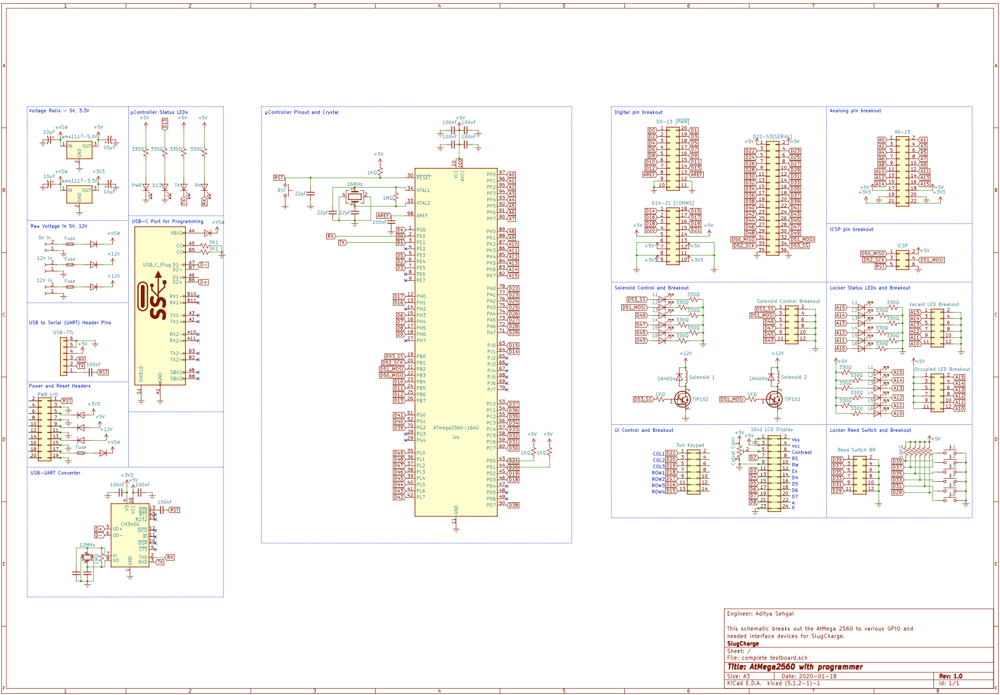

# *SlugCharge*

SlugCharge was a student run project geared towards helping the homeless communit of Santa Cruz, CA. The project was led by four Electrical Engineering students at the University of California, Santa Cruz. The team aimed towards providing solar powered charging stations to the community so they can stay conencted with family and potential employers that may turn their life around! 


### My Roles

* PCB Design
* Mechnical Design
* Graphic Design
* Video Creation

<!-- ```
Give examples
``` -->

### PCB Design

#### PCB #1
* We first started with making a testbench that was able to run our code and interact with the required I/O </br>
    Requirements:</br>
    * Utilize the **ATmega2560** as the main processor
    * Be **easliy programmable** for future code updates
    * Contain **visual annunciators** for easy state tracking 
    * Utilize **breakout pins** for off-board I/O control
    * Should **not require off-board voltage regulation**
    * Should be easily **hand assembled**
    * Restricted to a **2-layer PCB**
* The design was started off with referring to the Arduino Mega Development board and adapted to fit the required I/O:

<!-- <embed src="SlugCharge_Testbench_V1.0/Schematic.pdf" type="application/pdf"> -->
<!-- <object data="/SlugCharge_Testbench_V1.0/Schematic.pdf" type="application/pdf" width="100%">  -->
</object>

## Running the tests

Explain how to run the automated tests for this system

### Break down into end to end tests

Explain what these tests test and why

```
Give an example
```

### And coding style tests

Explain what these tests test and why

```
Give an example
```

<!-- ## Deployment

Add additional notes about how to deploy this on a live system -->

## Built With

* [KiCad](https://kicad-pcb.org/) - Used to design schematics and PCB layouts
* [Fusion 360](https://www.autodesk.com/products/fusion-360/overview) - Used to design mechanical drafts
* [Arduino IDE](https://www.arduino.cc/) - Used to code the charging station functionaility
* [Affinity Designer](http://affinity.serif.com/) - Used to design logos and other 2-D graphics
* [VSDC Video Editor](http://www.videosoftdev.com/) - Used to design education videos of the charging station

<!-- ## Contributing

Please read [CONTRIBUTING.md](https://gist.github.com/PurpleBooth/b24679402957c63ec426) for details on our code of conduct, and the process for submitting pull requests to us. -->

<!-- ## Versioning

We use [SemVer](http://semver.org/) for versioning. For the versions available, see the [tags on this repository](https://github.com/your/project/tags).  -->

## Authors

* **Aditya Sehgal** - *Systems Integration lead, PCB Designer, Mechanical Drafter and Graphic Designer* - [AdSehgal](https://github.com/AdSehgal)

<!-- See also the list of [contributors](https://github.com/your/project/contributors) who participated in this project. -->